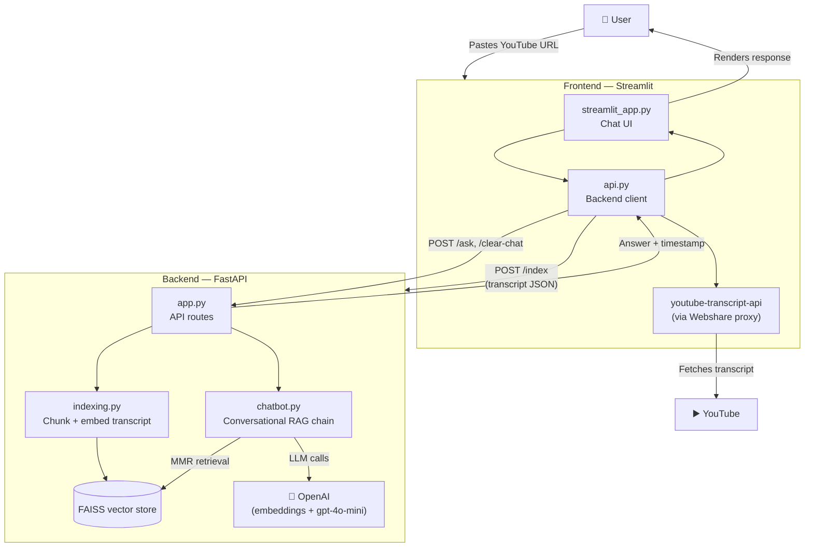

# 🎥 YouTube RAG Chatbot

Chat with any YouTube video using AI. This project has two parts — a **Streamlit frontend** and a **FastAPI RAG backend** — that together let you paste a YouTube URL, index its transcript, and ask questions about the video with timestamped, context-aware answers.

| Part | Stack | Repo/Folder |
|---|---|---|
| Frontend | Streamlit, youtube-transcript-api | `frontend/` |
| Backend | FastAPI, LangChain, FAISS, OpenAI | `backend/` |

---

## 🏗️ Architecture



**Flow in short:**
1. **Frontend** fetches the video's transcript directly from YouTube (client-side, via an optional proxy to avoid IP blocks) and sends it to the backend.
2. **Backend** chunks the transcript, embeds it, and stores it in a local FAISS vector store.
3. User questions go from the frontend → backend, which retrieves relevant chunks (MMR search) or runs a whole-video summarizer, then calls OpenAI to generate an answer.
4. The answer (plus a timestamp, when available) flows back to the frontend and is rendered in the chat.

---

## 🚀 Quick Start

1. **Start the backend** (see `backend/README.md` for full details)
   ```bash
   cd backend
   pip install -r requirements.txt
   uvicorn app:app --reload
   ```

2. **Start the frontend** (see `frontend/README.md` for full details)
   ```bash
   cd frontend
   pip install -r requirements.txt
   streamlit run streamlit_app.py
   ```

3. Open `http://localhost:8501`, paste a YouTube URL, index it, and start chatting.

---

## 📄 License

This project is licensed under the MIT License.
